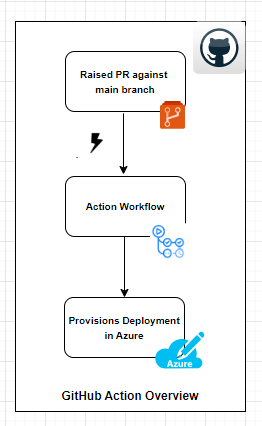
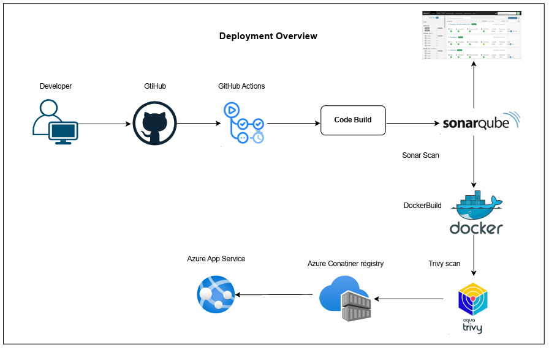

## **Terraform-weather-myob-app**

This Terraform root module demonstrates deployment of myob TechChallengeApp to [Azure Cloud](https://login.microsoftonline.com/)

- Contents of this README:
  1. **What is being provisioned**
  2. **Requirements**
  3. **Providers**
  4. **Modules**
  5. **Resources**
  6. **Inputs**
  7. **High level architectural overview of deployment**
      - *GitHub Action overview*
      - *deployment-overview*. 
  8. **Deployment**
      - *GitHub Actions (Automated Process)*
      - *Manual Deployment*. 
  9. **Technical Challenge URL**
  10. **Contact / Getting help**
  11. **License**
  ---
## 1. What is being provisioned
- Azure Conatiner Registry
- Azure Conatiner Apps
- TechChallengeApp 
## 2. Requirements
---
| Name | Version |
|------|---------|
| <a name="requirement_terraform"></a> [terraform](#requirement\_terraform) | >= 0.14.0 |
| <a name="requirement_terraform"></a> [azurerm](#requirement\_azurerm) | = 3.96.0 |
---
## 3. Providers

| Name | Version |
|------|---------|
| <a name="requirement_terraform"></a> [azurerm](#requirement\_azurerm) | = 3.96.0 |

## 4. Modules

No modules.

---
## 5. Resources

| Name | Type |
|------|------|
| [azurerm_resource_group](https://registry.terraform.io/providers/hashicorp/azurerm/latest/docs/resources/resource_group) | resource |
| [azurerm_container_registry](https://registry.terraform.io/providers/hashicorp/azurerm/latest/docs/resources/container_registry) | resource |
| [azurerm_linux_web_app](https://registry.terraform.io/providers/hashicorp/azurerm/latest/docs/resources/app_service) | resource |
---
## 6. Inputs

| Name | Description | Type | Default | Required |
|------|-------------|------|---------|:--------:|
| <a name="input_rg-name"></a> [rg-name](#input\_azurerm\_api) | The Resource Group name | `string` | `"weathermyob-rg"` | yes |
| <a name="input_location"></a> [location](#input\_azurerm\_app\_name) | The Resource Group Location | `string` | `"Australia East"` | yes |
| <a name="input_container-registry"></a> [conatiner-registry](#input\_azurerm\_app\_name) | The conatiner registry name | `string` | `"weathermyobacr"` | yes |
| <a name="input_container-app"></a> [azurerm_linux_web_app](#input\_azurerm\_app\_name) | The conatiner app name | `string` | `"myobdapp"` | yes |
| <a name="input_docker_image"></a> [docker\_image](#input\_docker_image) | Docker image to use | `string` | `weatherapi` | yes |
| <a name="input_docker_image_tag"></a> [docker_image_tag](#input\_docker_image_tag) | Docker image tag to use | `string` | `latest` | yes |

# 7. High level architectural overview of deployment


| *GitHub Action overview* | *deployment-overview* |
|------|------|
|  | 
---
# 8. Deployment
### GitHub Actions (Automated Process) -- Recommended
- Whenever new code is merged to the main branch then the GitHub action will be triggered automatically.
- On successful build completion, Tech Challange App will be provisioned in Azure Cloud
- The secret variables are configured in Github
- Full workflow about provisioning Tech Challange App and available in the [](.github/workflows/servian-app-actions.yml)
### Manual Deployment

### Installing Terraform
Terraform should be installed on your system. [Instructions available here](https://learn.hashicorp.com/tutorials/terraform/install-cli). Once installed check the version, it should be at least `0.14.2` or higher:

```shell
$ terraform version
Terraform v1.0.7
```
### Initalizing Terraform
Next Terraform needs to download the necessary provider plugins, modules and set up the initial (empty) state. Start by executing

```shell
$ terraform init
```
### terraform plan 
Now you are ready to run terraform [plan](https://www.terraform.io/docs/commands/plan.html) with secrets vraiables :

```shell
$ terraform plan -var="cf_org_name=${{secrets.CF_ORG_NAME}}" -var="cf_username=${{secrets.CF_USERNAME}}" -var="cf_password=${{secrets.CF_PASSWORD}}" -var="cf_space_id=${{secrets.CF_SPACE_ID}}" -out=tfplan
```
Terraform will calculate an execution plan and display all the actions it needs to perform to deploy app and components.

### terraform apply
The [apply](https://www.terraform.io/docs/commands/apply.html) step will kick off provisioning of all resources:

```shell
$ terraform apply -auto-approve "tfplan"
```

This typically
takes between 5-15 minutes. The majority of the time is spend waiting on the PostgreSQL database to become available for use.
Once the apply step finishes you should see something like below:

```shell
Apply complete! Resources: 4 added, 0 changed, 0 destroyed..
```
## terraform destroy
You can remove all created resources using the terraform [destroy](https://www.terraform.io/docs/commands/destroy.html) command

```shell
$ terraform destroy
```
# 9. Technical Challenge URL

To Access Technical Challenge URL depolyed in cloud foundry:

```shell
url:(https://myobdapp.azurewebsites.net/swagger/index.html)
```
# 10. Contact / Getting help
Please reach me at  [Sanju Khetavath](mailto:rathodsanju399@gmail.com)

# 11. License
[License](./LICENSE.md) is MIT
<!-- BEGIN_TF_DOCS -->
## Requirements

No requirements.

## Providers

No providers.

## Modules

No modules.

## Resources

No resources.

## Inputs

No inputs.

## Outputs

No outputs.
<!-- END_TF_DOCS -->